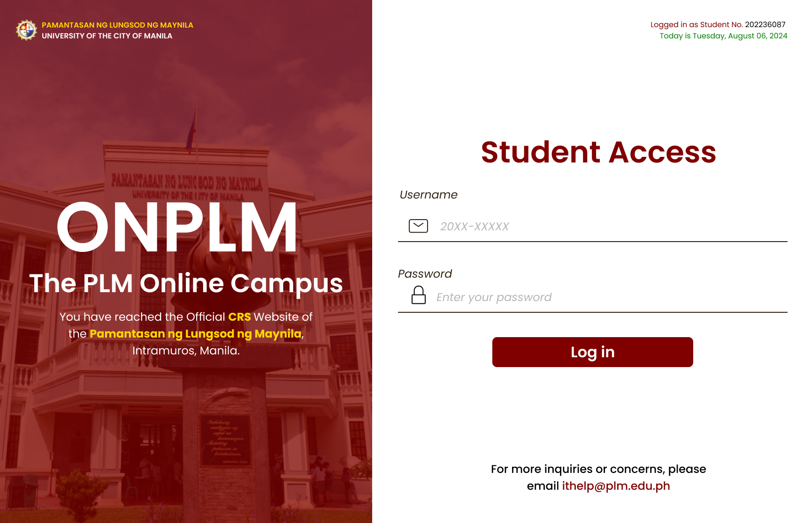
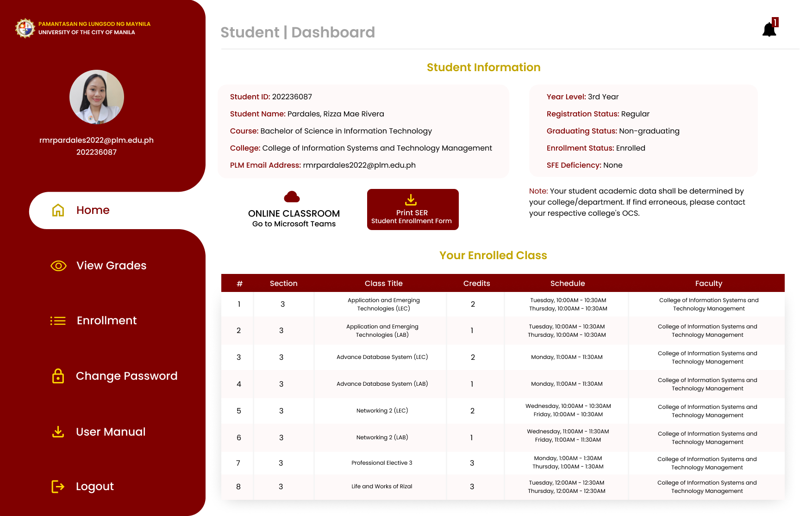
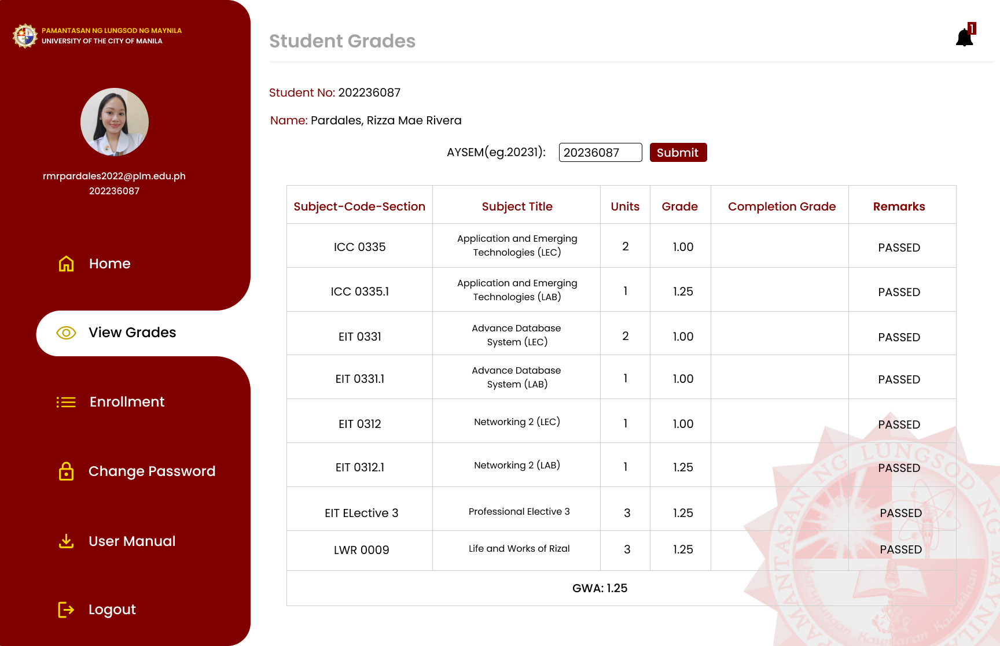
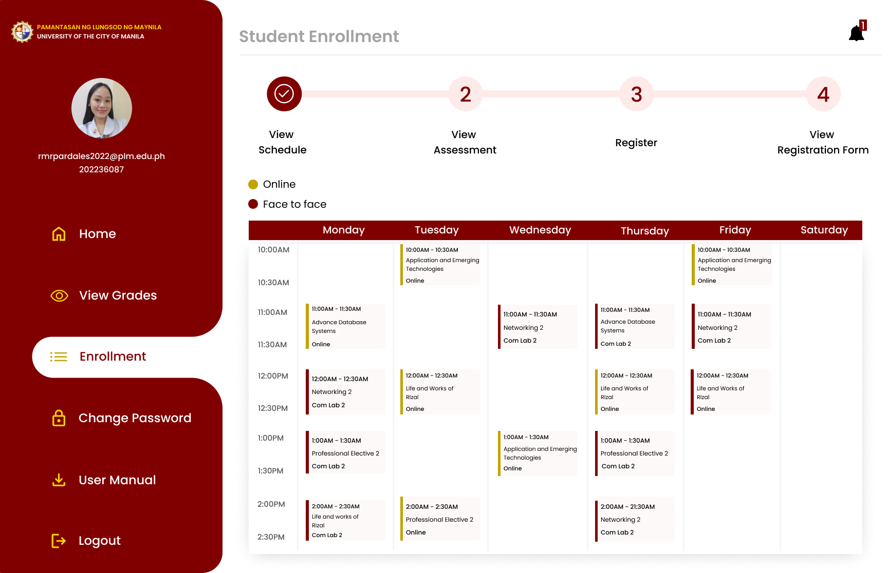
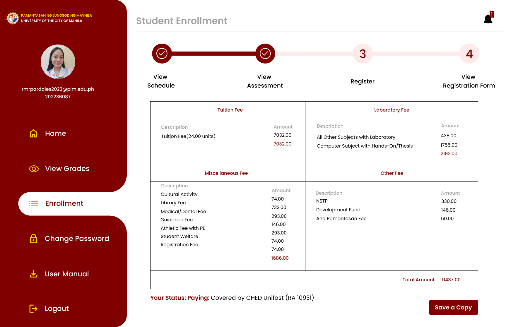
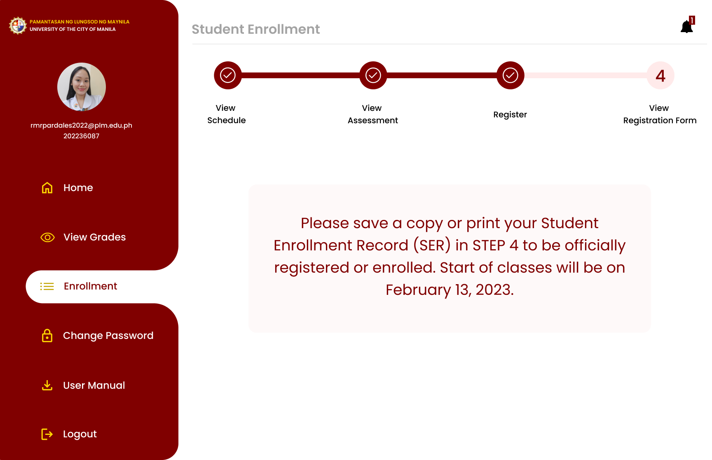
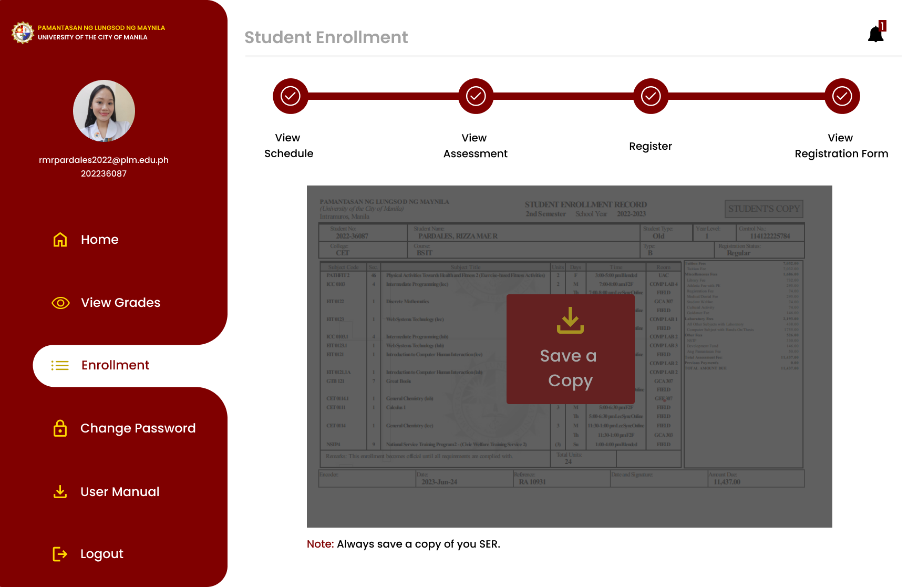
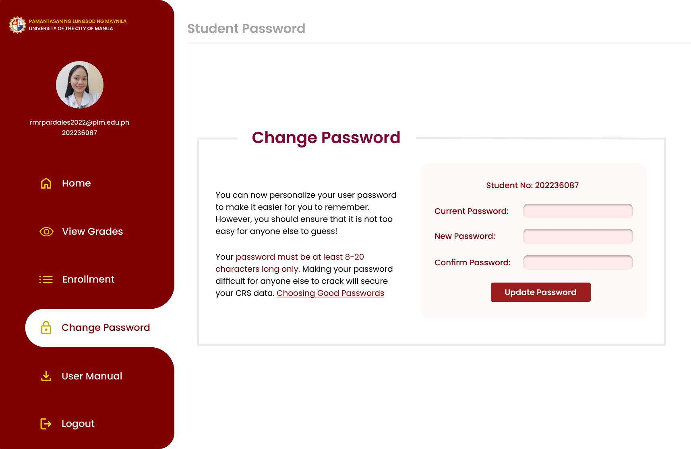

# PLM CRS Redesign

## Description
The **Pamantasan ng Lungsod ng Maynila Course Registration System (PLM CRS)** is an essential platform for PLM students, allowing them to enroll in courses, manage their class schedules, and view their grades. It serves as the primary gateway for students to access their academic records and streamline their educational journey.

## Purpose
The purpose of this project is to redesign the existing PLM CRS to enhance its usability, accessibility, and overall user experience. This redesign aims to provide a more intuitive interface, improve system performance, and ensure that students can efficiently complete their academic tasks with minimal effort.

## Link

You can interact with the design on figma:

[PLM CRS on Figma](https://www.figma.com/proto/CrpwT5g1xF4n22ls6AGwGr/Redesign-PLM-CRS?page-id=0%3A1&node-id=1-2&viewport=-828%2C-325%2C0.28&t=xocmufbMymVJjFZS-1&scaling=scale-down&content-scaling=fixed&starting-point-node-id=1%3A2)

You can view the project on Behance:

[PLM CRS on Behance](https://www.behance.net/gallery/205751911/PLM-CRS-Redesign)

## Design Preview

